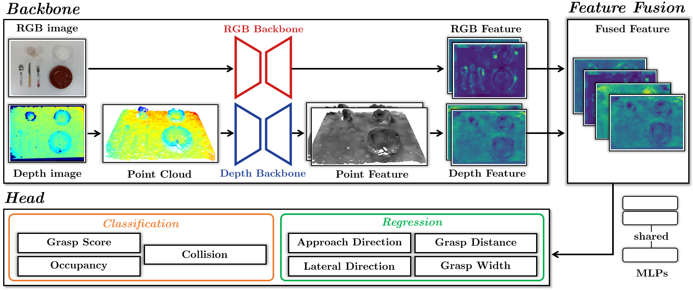

# RGBD-FGN

Jaemin Yoon, Joonmo Ahn, Changsu Ha, Rakjoon Chung, Dongwoo Park, Heungwoo Han, Sungchul Kang, "**RGBD Fusion Grasp Network with Large-Scale Tableware Grasp Dataset**.", IEEE/RSJ International Conference on Intelligent Robots and Systems (IROS), 2023.

<br />

<p align="center">
  
  <br> Architecture of our proposed RGBD-FGN.
</p>

<br />

## Installation
This code has been tested with python 3.8.8, tensorflow 2.8.0, CUDA 11.2, cudnn 8.1.1.

Get the code.
```
git clone https://github.com/SamsungLabs/RGBD-FGN.git
cd RGBD-FGN
```
Compile PointNet++
```
sh setup.sh
```
<br />

## Download Data and Model
### Data
<!--Download our grasp dataset from [here](https://drive.google.com/) and copy them into the `RGBD-FGN/` folder with name of `RGBD-FGN-DATA`.-->
Uploading our grasp dataset is being delayed due to license issues. It will be updated.

#### Data tree
In your folder `RGBD-FGN/RGBD-FGN-DATA`,
```
  RGBD-FGN-DATA
    └scene_00000000
      depth
        *.png
      depth_syn
        *.png
      label_id
        *.png
      meta
        *.npz
      rgb
        *.jpeg
      scene_grasp_infos
        *.npz
      seg_id
        *.png
    └scene_00000001
    :
    └scene_00000799
```

### Model
Download our pretrained model from [here](https://github.com/SamsungLabs/RGBD-FGN/releases/tag/Pretrained_Model) and copy them into the `RGBD-FGN/` folder with name of `logs`. 


<br />


## Training
Befor training, you should convert raw data in `RGBD-FGN-DATA` to train data (it takes few hours).
```
python train_data_generation.py
```
Then, you can get three files in `RGBD-FGN-DATA/train_data/` (`input_data.npz, output_data.npz, position_distance_minmax.npz`).

After that, you can train our model
```
python train.py
```

<br />

## Testing
You can visualize inference results.
```
python test.py
```
Here, you can change the threshold value in the code.

`score_threshold`: Only points with grasp score (0 to 1) greater than to this value are inferred.

`collision_threshold`: Only points with collision value (0 to 1) smaller than to this value are inferred.

`occupancy_threshold`: Only points with occupancy value (0 to 1) greater than to this value are inferred.

<br />

## Citation

```
@article{yoon2023rgbd,
  title={RGBD Fusion Grasp Network with Large-Scale Tableware Grasp Dataset},
  author={Yoon, Jaemin and Ahn, Joonmo and Ha, Changsu and Chung, Rakjoon and Park, Dongwoo and Han, Heungwoo and Kang, Sungchul},
  booktitle={2023 IEEE/RSJ International Conference on Intelligent Robots and Systems (IROS)},
  year={2023}
}
```
