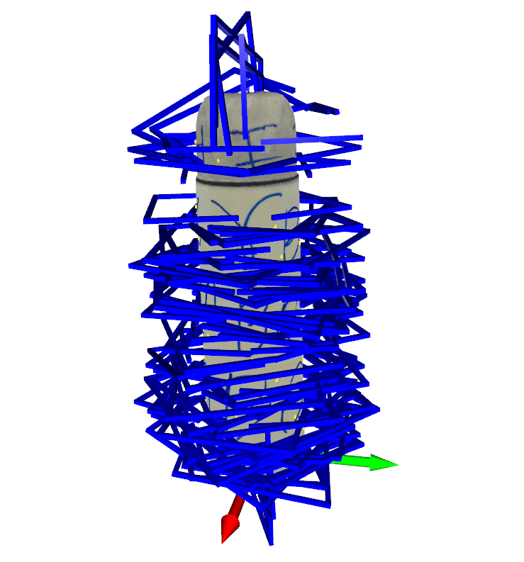
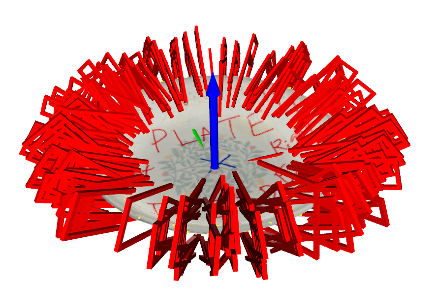
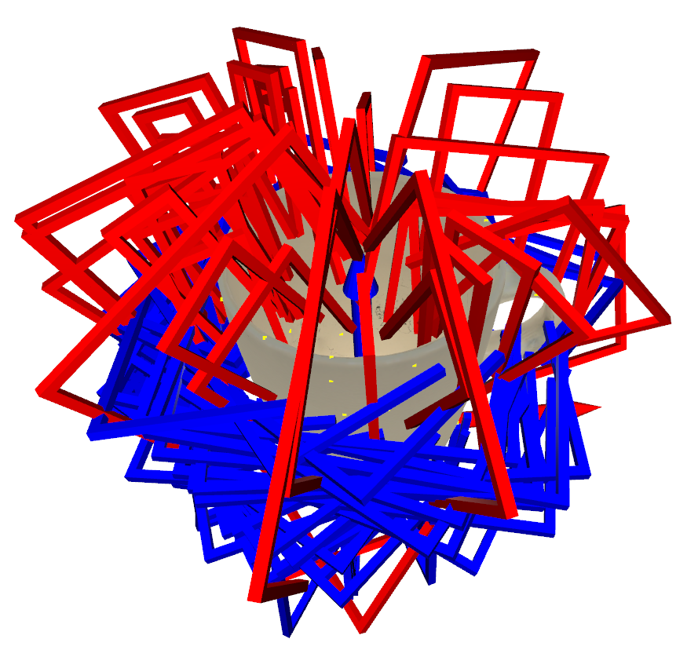
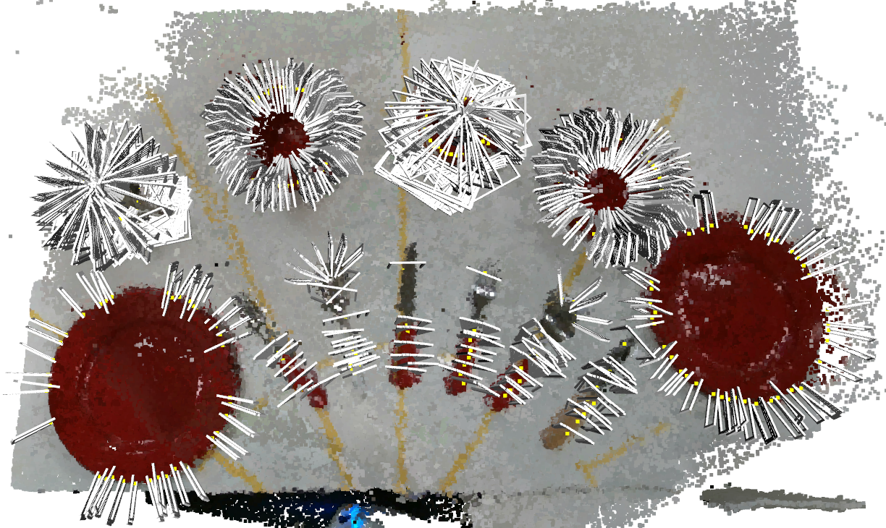
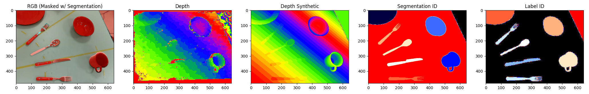

# Object-Level Data

## Download

Download our object-level data from [TO-BE-ANNOUNCED](https://to-be-announced) and copy them into `RGBD-FGN/RGBD-FGN-DATA/object_level_data`

## Data Structure

```bash
object_level_data
└ bottle
:
└ (obj_class)
  └ (obj_subclass)
    └ *_modified.obj        # original mesh file
    └ *_modified.mtl        # mtl file according to *_modified.obj
    └ *_modified_0.png      # texture according to *_modified.obj
    └ *_modified_cvx.obj    # convexified version of *_modified.obj
    └ *_modified_subdiv.obj # subdivided version of *_modified.obj
    └ thumbnail_real.jpg    # thumbnail image of object
    └ gsamples.json
        "grasp_poses"           # {N_g,7}, (x,y,z,qx,qy,qz,qw)
        "grip_widths"           # {N_g}, 0.001~0.115 w/ 0.005 interval
        "gq_antipodals"         # {N_g}, antipodal grasp quality
        "gq_contacts"           # {N_g}, contact grasp quality
        "gq_displacements"      # {N_g}, displacement grasp quality
        "grasp_labels"          # {N_g}, grasp label (0:body, 1:edge)
        "control_points"        # {N_g,3}, (x,y,z) reference points
:
└ spoon
```

## Data Visualization
Visualizes grasp poses with object mesh. Also you can visualize grasp poses generated for body reference points (colored in blue), and edge reference points (colored in red). The reference points are marked in yellow.

<p align='center'>



</p>

### Usage Example
```
python visualize_object_level_data.py --dataset_dir object_level_data --obj_class bottle --obj_subclass bottle_1 --grasp_subsample_rate 20 --show_all False
```

### Option Description
| Option               | Type | Description                                                                                 | Default           |
| -------------------- | ---- | ------------------------------------------------------------------------------------------- | ----------------- |
| dataset_dir          | str  | Dataset dir where your object level data exists                                             | object_level_data |
| obj_class            | str  | Object class name                                                                           | bottle            |
| obj_subclass         | str  | Object subclass name. Be sure to exist in 'obj_class'                                       | bottle_1          |
| grasp_subsample_rate | int  | Grasp subsample rate (1 for show all grasps)                                                | 20                |
| show_all             | bool | Shows all meshes sequentially. 'obj_class', 'obj_subclass' are meaningless if show_all=True | False             |


<br />

# Scene-Level Data

## Download

Download our scene-level data from [TO-BE-ANNOUNCED](https://to-be-announced) and copy them into `RGBD-FGN/RGBD-FGN-DATA/scene_level_data` 

<br />

## Data Structure
```bash
scene_level_data
└ scene_00000000
:
└ scene_(scene_n)
  └ rgb
    :
    └ (scene_n)_(frame_n).jpeg    # {480,640,3}, real rgb image (0~255)
  └ depth
    :
    └ (scene_n)_(frame_n).png     # {480,640,1}, real depth image (mm)
  └ depth_syn
    :
    └ (scene_n)_(frame_n).png     # {480,640,1}, synthetic depth image (mm)
  └ seg_id
    :
    └ (scene_n)_(frame_n).png     # {480,640,1}, Pybullet object unique id (0~255)
  └ label_id
    :
    └ (scene_n)_(frame_n).png     # {480,640,1}, label id of object class (0~255)
  └ meta
    :
    └ (scene_n)_(frame_n).npz
        "cam_pose"                      # {7}, (x,y,z,qx,qy,qz,qw) w.r.t. world frame
        "intrinsic"                     # {6}, (img_width,img_height,fx,fy,cx,cy)
        "table_seg_id"                  # {SCALAR}, 0~255
  └ scene_grasp_infos
    └ scene_(scene_n).npz
        "grasp_poses"                   # {N,7}, (x,y,z,qx,qy,qz,qw) w.r.t. world frame            
        "grasp_widths"                  # {N}, 0.005~0.115 w/ 0.005 interval
        "grasp_quality_antipodals"      # {N}, 0.0~1.0
        "grasp_quality_contacts"        # {N}, 0.0~1.0
        "grasp_quality_displacements"   # {N}, 0.0~1.0
        "grasp_collisions"              # {N}, boolean
        "grasp_seg_ids"                 # {N}, 0~255
        "grasp_control_points"          # {N,3}, (x,y,z) reference points
:
└ scene_00000799
```
In `label_id` data, each value corresponds to following object class.
| Label ID | Object Class |
| -------- | ------------ |
| 0        | background   |
| 1        | plate        |
| 2        | bowl         |
| 3        | cup          |
| 4        | spoon        |
| 5        | fork         |
| 6        | knife        |
| 7        | bottle       |
| 8        | container    |
| 255      | table        |

<br />

## Data Visualization
Visualizes grasp poses (w/o collision) with point cloud in certain scene_num and frame_num. The reference points are marked in yellow. 
Also, visualizes rgb, depth, depth_syn, seg_id, label_id.

<p align='center'>

</p>
<p align='center'>

</p>

### Usage Example
```
python visualize_scene_level_data.py --dataset_dir scene_level_data --scene_num 00000000 --frame_num 00000000 --grasp_subsample_rate 2 --show_all_pcd True --show_masked_rgb True
```

### Option Description
| Option               | Type | Description                                             | Default          |
| -------------------- | ---- | ------------------------------------------------------- | ---------------- |
| dataset_dir          | str  | Dataset dir where your scene level data exists          | scene_level_data |
| scene_num            | int  | Number of scene in 8 digits                             | 00000000         |
| frame_num            | int  | Number of frame in 8 digits                             | 00000000         |
| grasp_subsample_rate | int  | Grasp subsample rate (1 for show all grasps)            | 2                |
| show_all_pcd         | bool | Shows point cloud reconstructed from all view of frames | True             |
| show_masked_rgb      | bool | Shows RGB image masked using segmentation               | True             |

